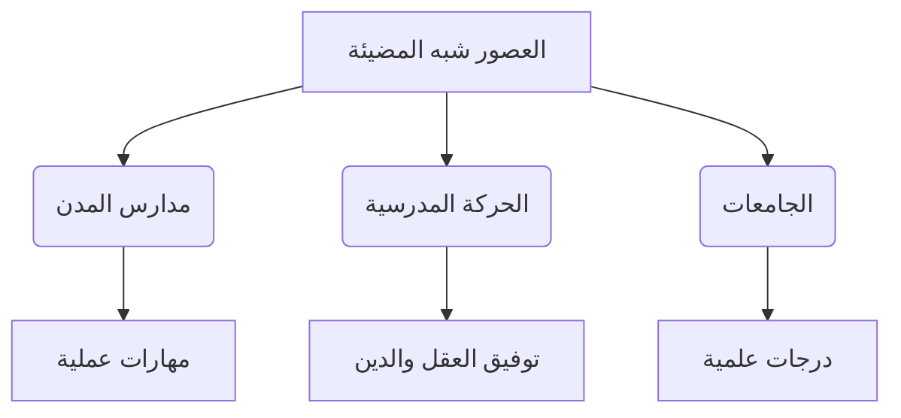

https://youtu.be/tkXDRWSo5bM?si=A0YJdjlSUSAWveGO

بسم الله الرحمن الرحيم الحمد لله رب
العالمين والصلاه والسلام على اشرف الخلق
اجمعين سيدنا محمد وعلى اله وصحبه وسلم
اجمعين ثم اما
بعد اخواني الاعزاء طلاب الفرقه الثانيه
بكليه التربيه بنين بالقاهره جماعه الازهر
السلام عليكم ورحمه الله تعالى وبركاته
واهلا وسهلا بحضراتكم في محاضره جديده من
مقرر تاريخ التربيه ونظام
التعليم المحاضره تدور حول الجزء الثاني
من الفصل الخامس بعنوان التربيه المسيحيه
في العصور
الوسطى محدثكم محمود مصطفى احمد مدرس بقسم
الاداره والتخطيط والدراسات
المقارنه في المحاضره الماضيه كنا اتكلمنا
حول بعض العناصر المتعلقه بهذا
الفصل ومنها
ما في ماه ماهيه العصور الوسطى تكلمنا عن
العصور الوسطى
وتقسيم العصور الوسطى الى عصور مظلمه
وعصور وسطى شبه مضيئه ودي خريطه لامتداد
الامبراطوريه الرومانيه في العصور الوسطى
ثم بعد ذلك تقسيم الامبراطوريه الرومانيه
الى امبراطوريه رومانيه غربيه وامبراطوريه
رومانيه
شرقيه وتكلمنا عن عن الظروف والعوامل
والاحوال المؤثره على التربيه في اوروبا
في العصور الوسطى انتشار المسيحيه
والاعتراف بها كدير رسمي ثم النظام
البابوي وتغول الكنيسه
ا ثم بعد ذلك الاحوال السياسيه المتمثله
في السلطه الزمنيه سلطه
الامبراطور ثم بعد ذلك تكلمنا عن الاحوال
الاجتماعيه عن المجتمع عن مركز المراه في
المجتمع عن الطبقيه
والاقطاع وتكلمنا كذلك حول الاحوال
الاقتصاديه في المجتمع في اوروبا في
العصور
الوسطى والطابع الزراعي والاقطاع ثم بعد
ذلك تناولنا بالتفصيل اهداف التربيه
المسيحيه في العصور
الوسطى واخيرا تناولنا بعض مؤسسات التربيه
المسيحيه في العصور الوسطى حيث تكلمنا عن
مدارس الاديره والرهبنه مدارس الشهداء
مدارس تعلم المبادئ المسيحيه مدارس الحوار
الديني مدارس
الكاتدرائيه و اليوم بمشيئه الله تعالى
نكمل في
مؤسسات التربيه في المسيحيه في العصور
الوسطى من ضمن المدارس التي انشئت في
اوروبا في العصور الوسطى مدارس الانشاد او
الغناء طبعا الانشاد والغناء كان له اهميه
كبيره للكنيسه ومن ثم نشات الحاجه
الى وجود
صبيا يتم تدريبهم على الغناء والترتيل
والترنيم
للكتاب
السماوي الديانه المسيحيه وهو الانجيل
فانش هذه المدارس كان البابا جريجوري
الاول رائدا في انشاء هذه المدارس وكانت
هذه المدارس ملحقه
بالكاتدرائيه مدارس الغناء كانت مقتصره
على تعليم اولاد الفقراء بصفه عامه وكانوا
يعلمون فيها مجانا ويقيمون فيها اقامه
كامله في مقابل ان يقومون بخدمه الكنيسه
في النواحي المختلفه وفي مقدمتها الغناء
والترانيم وكانوا يتعلمون الى جانب الغناء
مبادئ اللغه اللاتينيه واحيانا الحساب
وقله من خريج هذه المدارس اصبحوا فيما بعد
قساوسه مدارس البلاء كانت هناك مدارس
للبلاط البلاط اللي هم الطبقه العليا او
طبقه النبلاء والفرسان الاقطاعيين
وانشائها الملوك والنبلاء لتعليم ابنائهم
واجازه في دخول الممتازين من ابناء العامه
في هذه المدارس لانها كانت منتشره الى حد
ما في الاقطاعي المختلفه كانت هذه المدارس
فرصه التعليم الوحيده في
الريف خش بقى على تربيه الفرسان ولو ولو
رجعنا
بقى المحاضره الماضيه
لما اتكلمنا على
انه المجتمع الاوروبي في تلك الفتره في
العصور الوسطى انقسم الى ثلاث طبقات منها
طبقه النبلاء وطبقه الفرسان وطبقه رجال
الدين واخيرا طبقه ايه الفلاحين طبقه
الفرسان دي عملت لنفسها مدارس خاصه بتربيه
الفرسان مدارس خاصه بتربيه الفرسان لان
القرون الوسطى اصلا كانت متميزه
بالفروسيه ا
والفروسيه دي كانت تعتبر نظام اجتماعي
واخلاقي لنبلاء الاقطاعيين وكانت في حد
ذاتها مثل اعلى كانت ايه مثل اعلى يبقى
الفروسيه تنتمي الى طبقه النبلاء وكانت
تمثل لهم مثل اعلى ومن ضمن الحياه التي
كانوا يعني القيم التي يتربى عليها الفارس
الموت دون الشرف او الدفاع عن الشرف حتى
ايه حتى الموت وكانت هذه القاعده تطبق
عاده في مواقف الدين او الحرب او الحب
وا الفروسيه هي على عكس من الاديره
والرهبنه الاديره والرهبنه كانت تهتم
بالجانب التربيه الروحيه الفروسيه كانت
تهتم بالتربيه الجسديه من الاخلاقيات التي
يربي عليها
الفارس التاديب الشرف الاخلاص
ا التلطف التحرر احترام المراه الايمان
والتقوى كان على الفارس ان يقسم اليمين
على ان يخاف خف الله تعالى ويخشاه ويعبده
وان يراعيه وان يحمي حقوق الارامل
والضعفاء ومن لا حول له وان يحمل كنيسه
طبعا الكلام ده ما كانش كله بيتطبق لكن
نقدر نعتبر ان الفروسيه كانتت
ا من ضمن الاشياء المميزه الموجوده في
العصور
الوسطى
طيب تعالوا بقى نشوف منهج الفروسيه وهدف
الفروسيه ومراحل تربيه الفارس هدف
الفروسيه هي نظام تربوي لتعليم الفرسان
وتربيه الرجل المهذب يعني نقدر نقول ان
الهدف الاساسي منها انتاج الرجل المهذب زي
ما قلت حضراتكم الذي يتحلى بالشرف
والاخلاص والشجاعه والتقدير والتلطف الى
غير ذلك ومن ثم عشان يقدر نسميه ان هو
فارس يعني زي ما بيقول احنا دلوقتي في في
كلماتنا الدارجه هذه اخلاق ايه اخلاق
الفرسان
طيب منهجهم او منهج منهج الفروسيه كان
بيتم ازاي كان الفارس يمر من خلال تربيته
وتعليمه في نظام قاس طويل يتضرب فيه على
التمارين الرياضيه والالعاب الشاقه
واستخدام اسلحه الحرب والمبارزه وكان
يتحتم على الصبي تعلم ركوب الخيل وال
والقتال راكبا
ومرتجع طبعا كما تقررت عليهم تمارين بدنيه
اشبه بالتمارين التي كانت موجوده في
اسبرطه في القرنين السادس والخامس قبل
الميلاد بالاضافه ال حاجه كمان كان يجب
على الصبي الذي يعد ان يكون فارسا ان
يتعلم كيف يرق ويتعطر ويتلطف
ويتخير انسب الكلام واعذبه وكيف يقرض
الشعر ويعزف على اله موسيقيه كانت اشهر
اله موسيقيه عندهم في ذلك هي القيثار مع
الترنم باغنيه
جميله ولذلك يقال ان الفروسيه هي التي
حافظت على الادب هي التي الادب
ا الروماني والادب الاوروبي ونقلته الى
العصور ايه العصور الحديثه لكن كان
التربيه عقليه الاهتمام بها ضعيفا الا
طبعا اللهم الا من تعلم اللغه الفرنسيه
والتي كانت هي لغه ايه الفروسيه في العصور
المتاخره من القرون الوسطى طيب مراحل
تربيه الفارس مراحل تربيه
الفارس الفارس كان بيمر بمرحلتين اساسيتين
المرحله الاولى تربيه الغلام ودي كانت من
سن سبعه الى سن 14
سنه طبعا وفيها كان الغلام يقوم بماذا
يقوم بالخدمه في احدى القلاع يعني مكان
تربيه الفارس في القلعه ثم ا وخاصه خدمه
مين خدمه النساء ثم يخدم في الموائد الكبر
في الموائد بعد ان يكبر
لما يوصل سن 14 سنه يدخل في مرحله تربيه
الشعب وتمتد هذه المرحله الى 21
سنه والفارس في تلك المرحله او الشاب يقوم
بخدمه سيده الفارس الاساسي ثم يصبح الخادم
الشخصي له في المعركه وفي الحفلات ايه و
في الحفلات العامه يعني يصاحب سيده
الفروسيه تركت اثارها البارزه في اوروبا
في اثناء العصور الوسطى والعصر الحديث من
النواحي الاجتماعيه والنواحي التربويه
والاخلاقيه والادبيه فالفروق كانت ملهمه
وكانت غذاء لنهضه الاداب المحليه التي
وجدت في تربيه في وجدت في تربيه الفارس
موضوعات كثيره له يعني ده بيشبه لي يا
شباب
بالفروسيه اللي كانت موجوده في عصر ما قبل
الاسلام عند العرب يعني اسم عن عن طره
وابن شداد وعمرو بن كلثوم وكثير من
الفرسان وكليب والزير سالم وغيرهم من
الفرسان الذين كانوا ايه في العرب في
الجاهليه طبعا طبعا كانوا يهتمون بالشعر
والقوه والشجاعه وحفظ العهود وطبعا الحفاظ
على القبيله وهكذا طبعا هي التي حفظت ايه
الادب وكانت ملهمه للادب والشعراء
والشعر انتهى نظام الفروسيه في القرن ال
17 نتيجه للحروب الدينيه واهتزاز النظام
الاجتماعي اهم ما يميز الفروسيه نظامها
الاخلاقي القائم على الطبقه الاجتماعيه
كذلك ايضا انها كانت هي التي حافظت على
التراث
الادبي ظهور مدارس المدن لو تفتكروا
حضراتكم لما اتكلمنا وقسمنا العصور الوسطى
قسمناها الى قسمين العصور الوسطى المظلمه
والعصور الوسطى شبه المضيئ وقلنا من
علامات العصور الوسطى شبه المضيئه ازدهار
التجاره وظهور المدن وبدات الناس تهاجر
الى المدن طبعا هروبا من المشاكل اللي كان
بتحصل في اقطاعيات ونظام
العبوديه المدن اللي خلاها ازدهرت حركه
التجاره والتجاره بتحتاج الى قراءه وكتابه
ليه عشان نسجل التجاره دي ونقيدها ونعمل
حساباتها
ولذلك السلطات المحليه في المدن رغبه في
تعلم القراءه والكتابه وفي انتشار نشر
التجاره وازدهار الاقتصاد انشات مدارس
لتعلم القراءه والكتابه لشغل الوظائف
الكتابيه التي ظهرت زي ما قلت حضراتكم
بسبب ايه بسبب تزايد حركه التجاره كان من
اهم المدارس مدارس النحو ومدارس القراءه
والكتابه وهنا بقى نبدا نتكلم عن انها
كانت هذه المدارس للبنين وللبنات
طيب والمدارس دي كانت اول الدلائل على
انفصال الكنيسه عن الدوله في السيطره على
التعليم اه هنا بقى تبدا ايه يخف شويه
سيطره الكنيسه عن الدوله تبدا تظهر مدارس
بعيده عن عن عن عن سلطه الكنيسه تبدا تظهر
مدارس اللي مسيطر عليها السلطه المحليه في
المدن تبدا كمان المدن تتفاخر بتاسيس هذه
المدارس
وتبقى في تنافسيه ما بين المدن في تاسيس
هذ ايه تاسيس هذه المدارس وبين الاسرات في
تاسيس هذه المدارس في نهايه العصور الوسطى
كان اهتمام المحل بالتعليم واضحه وكان كل
مجتمع يفخر بتاسيس المدارس كما خصصت اموال
للمنح الدراسيه للعديد من الطلاب
والتلاميذ ذا دي مدارس ايه مدارس المدن
ونشات بسبب حركه التجاره واهتمام السلطات
المحليه بالتعليم والتعلم وهي دليل كما
قلت لحضراتكم عن انفصال
عن بدايه تضعضع سلطه الكنيسه على
التعليم التعليم في النقابات
الحرفيه ده بنسميه احنا ايه التدريب
المهني التدريب المهني المنظم او نقدر
نقول عليه التلمذه الصناعيه او ممكن نسميه
باسم دارج عندنا اسمه الصبينه اسمه ايه
الصبينه وكان من جمال هذه المدارس او
التعليم في ال النقابات انها كانت متاحه
لكل الطبقات وكان لكن على الاغلب اغلب
المرشحين كانوا للتدريب في هذه النقابات
من ابناء التجار وايه
والحرفيين وكان هذا النوع من التعليم من
افضل انواع التعليم المتوفره في العصور
الوسطى لانه كان تعليم
ا عملي يخضع لمعايير واختبارات تعليميه
ايه قاسيه وكانت تعقد هذه الاختبارات على
فترات لكي نضمن افضل ايه افضل الاداء طبعا
زي ما قلت لحضراتكم ده يعتبر نظام تلمذه
صناعيه كان يمر هذا النظام بعده مراحل
يعني التلميذ عشان يصل ويتقن هذه المهاره
كان بيتعرض لمده تدريب من خمسه الى 11 سنه
ويبدا من سن لا يقل عن سبع سنوات وكان هذا
التدريب مقتصرا على الصبيان المرحله
الاولى كان بيمت هذا التدريب من سن سبعه
الى سن ثمانيه من من من عمر الصبي وكان
يتبع معلمه يتعلم منه ومهارات واسرار
حرفته يراقبه في سلوكياته وينفذه الشاطر
مننا بقى يفتكر انه الكلام ده اللي هو
الملاحظه والتقليد كان موجود في التربيه
في العصر البدائي اذا يبقى اذا هو ده اسمه
ايه التنميه المهنيه وكان بيقوم الطفل
بخدمه ا معلمه بكل اخلاص وكانت الفتره دي
تنتهي طبعا باختلاف مدى اتقان الصبي او او
المتعلم ل مارات المهنه من معلمه المرحله
الثانيه
يكون الطفل او العامل او الصبي المتدرب
وصل الى مرحله المهاره لكنه لا يعمل
لحسابه ايه الخاص وانما يعمل
كاجير عند مين عند لحساب معلمه او لحساب
معلمين متنوعين في متاجرهم او مصانعهم
الصغيره لقاء اجر يومي
[موسيقى]
مدفوع مدرب او العامل الاجير
طبعا كجزء من حسابه على العمل الذي يقوم
به المرحله الثالثه بقى بيكون العامل قد
اظهر مهاره ملموسه ووصل الى تمكن في
الحرفه حينئذ تقوم النقابه نفسها التي
تنظم هذه الحرفه او المهنه باعلانه عضوا
كاملا في النقابه ويتم عمل حفل في علني
بذلك وعندئذ تسمح له النقابه بانشاء مصنع
خاص له او متجر خاص له حيث يمارس فيه
العمل لحسابه الخاص وتسمح له ايضا بان
يقبل صبياناً
المرحله وخاصه في النصف الثاني من العصور
الوسطى وهو نقدر نقول عليه العصور شبه
المضيئه اللي هي الحركه ايه الحركه
المدرسيه الحركه المدرسيه كانت المشكله
الرئيسيه طبعا را رائد الحركه المدرسيه هو
مين الفيلسوف توماس الاكويني والفيلسوف
توماس الاكويني تاثر كثيرا بالفيلسوف
الاسلامي ابن رشد المشكله الرئيسيه في
العصور الوسطى كيف نجمع بين الفكر والدين
بين العقل والنقل بين الفلسفه والقيم
الدينيه الاساسيه للكنيسه لانه لو حضراتكم
فاكرين قلنا انه ارخن لبدايه العصور
الوسطى باغلاق اكاديميه افلاطون لكن رجال
الدين بعد فتره ودخول عناصر مختلفه في
الديانه المسيحيه ودخول مثقفين في الديانه
المسيحيه بداوا يحتاجون الى التفكير
العقلي لدعم الديانه المسيحيه وبدات تظهر
بعض الشبهات حول الديانه المسيحيه واحتاج
رجال ل الدين الى تعلم فنون الحوار الديني
واستخدام اساليب الفلسفه في الاقناع مما
اضطرهم الى دراسه الفلسفه مره اخرى ومن
ضمن
هذه المدارس التي ظهرت مدرسه الحركه ايه
الحركه المدرسيه على يد تماس الاكويني
التي تجمع بين اللاهوت
والفلسفه باست لاستخدام الفلسفه في تدعيم
ايه في تدعيم اللاهوت
وبالتالي المحاولات الفكريه والعقليه دي
حاولت التوفيق بين ما يراه الفكر الانساني
الدنيوي المتمثل في الفلسفه وما تقوله
العقيده اي حاولت ايه الربط بين المعتقدات
المسيحيه
والفلاسفه المختلفين وارائهم واشهر هؤلاء
الفلاسفه اللي حاولوا ان هم يستخدمون
ارائهم في دعم الديانه المسيحيه اللي هو
منطق ايه منطق ارسطو منطق ارسطو يبقى اذا
كانت الحركه المدر يه تهدف الى فلسفه ايه
فلسفه الدين واستخدام اساليب النشاط
العقلي للدفاع عن العقيده وتقويه الحياه
الدينيه والقضاء على الشك والالحاد دي دي
اهداف الحركه ايه اهداف الحركه المدرسيه
يبقى اهدافها مره ثانيه استخدام الاسلوب
العقلي او النشاط العقلي للدفاع عن
العقيده وتقويه الحياه الدينيه والقضاء
على الشك وايه والالحاد عن طريق المناقشه
ولذلك كانت الدراسه في هذه الحركه
المدرسيه او كانت كانت عباره عن مزيج من
اللاهوت والفلسفه مزيج من المعتقدات
المسيحيه ومنطق ارسطو طيب وبالتالي ارادوا
ان يصوغ العقائد المسيحيه صياغه فلسفيه
وقلنا اشهر من قام بذلك هو توماس الاكويني
الذي عاش في الفتره من 1225 ميلاديه الى
سنه
1275 ميلاديه
طيب الموضوع ده جا ليه لانه كان هناك صراع
كبير بين العقل وبين السلطه الكنسيه ولذلك
اتت الحركه المدرسيه من اجل التوفيق
بينهما للاستعانه بالعقل في الدفاع عن
العقيده وتقويه الحياه الدينيه
والكنيسه الحركه المدرسيه استمرت حتى
القرن ال 15 وقد انتجت الكثير من الكتب
التي اثرت في عقول الدارسين تاثي
بالغه لكن هناك من انتقد الحركه
المدرسيه ليه لانه ا راوا انها ركزت على
شكليات فقط وانها كانت نوع من
ا كانت تستخدم اساليب
للوي الفلسفه
وتطويعها لخدمه الدين حتى وان كانت لا
تتوافق معه وبالتالي
ا ا كان ده من ابرز نقاط النقد الحركه
المدرسيه انها انها احيانا كانت ا تستخدم
الفلسفه بطريقه ملتويه ايا كان لكي تحقق
غردها اللي هو ايه اللي هو البرهنه على
العقائد الدينيه زي مثلا عقائد التثليث
وعقيده
عقائد الصلب
و عقائد مثلا العقائد المسيحيه العشاء
الاخير وهكذا كانت تستخدم كان الحركه
المدرسيه تستخدم الفلسفه بشكل غير منطقي
في دعم هذه
الحقائب
طيب الذروه بتاعه العصور الوسطى شبه
المضيئه اختتمت بحاجه مهمه جدا اللي هي
ظهور الجامعات ظهور الجامعات ظهور ايه
الجامعات الجامعات كانت في بدايتها طبعا
كانت تمثل اقصى قمه تعليميه في العصور
الوسطى وتعتبر الجامعات تعتبر ايه
الجامعات بمفهومها الحديث هي وليده القرون
الوسطى مع انه مصر القديمه ومن بعدها
العالم اليوناني والروماني عرفت معاهد
التعليم العالي عرفت معاهد التعليم العالي
فان العصور الوسطى هي التي خرجت ايه
العصور الوسطى هي التي خرجت لنا الجامعه
كما نعرفها اليوم يبقى اذا الجامعه
بمفهومها الحديث هو منتج من العصور
يبقى اذا الجامعات هي كانت اهم منتجات
العصور الوسطى شبه المضيئه وطبعا احنا
عارفين ان جامع الازهر انشا سنه 970 وهو
اقدم جامعه اسلاميه الى انه لم يطلق عليه
اسم جامعه الا عندما اعيد تنظيمه سنه
1961 طيب الجامعات في العصور الوسطى
الاوروبيه نمت نموا تلقائيا لم يخطط
لانشائها عن قصد وقد كان ظهور هذه
الجامعات ناتج لايه للحركه المدرسيه التي
وسعت الميدان العلمي والمعرفي وكان ايضا
نتيجه لظهور المدن ونموها وما صاحب ذلك من
تجمعات سكانيه كبيره طيب الجامعات في
بدايتها كانت في منى عن سلطه الكنيسه
والدوله ثم اغدقت عليها المنح البابويه
يعني البابا عشان يظهر نفسه مظهر الكرم
اصبح يعني اعطى منح كثيره ل الجامعات منها
حق التجول
المنتسبين للجامعه كمعلمين وكط لبه
الحمايه لهم حق محاكمه الطالب امام مجلس
الجامعه يعني يعني من يحاكم الطالب اذا
اخطا مجلس الجامعه حق الخريجين في التدريس
والاعفاء من الضرائب والخدمه العسكريه
الجامعات كانت بتعد الطلبه لمهن القانون
والطب واللاهوت وللتدريب الجامعي اهم سمات
الجامعات في العصور الوسطى الفقر ليه لانه
الجامعات في العصور الوسطى كانت لا ت لم
تكن تتلقى مساعدات ماليه انما بل كانت
تعتمد على التبرعات الخيريه من الملوك
والنبلاء ورجال الدين وكان في ناس منهم
بيساعدو بالمخطوطات عشان الدراسه الجامعات
كانت بطد الطلاب كانوا يدفعون رسوما قليلا
المعلمين كانوا يحصلون على اجورهم مما
يدفعه الطلاب له مباشره من رسوم دراسيه
الجامعات دي من سماتها ايضا الحريه لانها
انشئ على الطابع المدني العلماني بعيدا عن
سلطه الكنيسه بعيدا عن سلطه ايه بعيدا عن
سلطه الكنيسه من اشهر الجامعات زي كان
جامعه بولونيا التي تخصصت في دراسه ايه
القانون
طبعا البولونيا دي موجوده في جنوب ايطاليا
ممكن تسالني تقول اشمعنى جنوب ايطاليا
لانه جنوب ايطاليا كانت من اقرب هي
والاندلس كانت من اقرب الاماكن
الى العالم الاسلامي والتي اختلطت بشكل
كبير بالعالم الاسلامي وهناك بعض بعض بعض
العلماء العالم الاسلامي ذهبوا ودرسوا
في جزيره ثقليه التي تعتبر من اقرب
الاماكن الى الجنوب الايطالي زي
الادريسي العالم الشهير في الجغرافيا كذلك
ايضا جامعه ساليرنو التي اشتهرت بتخصصها
في الطب من ضمن
ايضا السمات العلمانيه زي ما قلت حضراتكم
العلمانيه عشان كانت بعيده عن سلطه ايه
الكنيسه العالميه الع عالميه وكانت جامعات
العصور الوسطى ز ت طابع عالمي لانها كانت
تضم اساتذه وطلابا من مختلف الشعوب وكانت
طلاب احيانا يقسمون الى مجموعات حسب دولهم
طيب ما هي الدرجات العلميه التي كانت تمنح
بهذه الجامعه منها البكالوريوس ويحصل
الطالب عليها بعد دراسته في النحو المنطق
ويؤدي امتحانا شفهيا امام لجنه من
الاساتذه الليسانس ويحصل الطالب عليها بعد
دراسه السنتين في قراءه المتون وشرحها
ويحق له بعد الحصول على الدرجه التدريس
الاستاذيه وكانت تتطلب دراسه مدتها خمس او
ست سنوات وكانت درجه الاستاذيه في الاداب
معادله لدرجه الدكتوراه في الفروع الاخرى
كذلك ايضا هناك بعض الجامعات كانت تقتصر
على منح درجتين فقط هما درجه الماجستير
ودرجه ايه
الدكتوراه اعتمدت طريقه التدريس في
الجامعات على الحفظ والتلقين ودراسه
المؤلفات العربيه لازم نلاحظ دي انها كان
بيدرسوا ايه المؤلفات العربيه لم يسمح
للاناث بالدراسه الجامعيه بل لم يسمح لهن
حتى بزياره ايه الجامعات من اولى الجامعات
في اوروبا زي ما قلت لحضراتكم جامعه
نابولي وبولونيا وروما وباريس وجامعه
اوكسفورد وكامبريدج
استفادت هذه الجامعات في مناهجها
ودراساتها ا واساليبها بما اعطاه العرب في
مي العلم والفلسفه كانت كتب العرب وكتب
علماء العرب زي كتب ابن الهيثم
والرازي وابن سينا وابن خلدون وابن رشد هي
التي كانت تدرس في الجامعات
الاوروبيه طيب ناخد بعض الشخصيات اشهر
الشخصيات التي كانت
موجوده في العصور الوسطى ناخذ شخصيه واحده
من هذه الشخصيات شارلمان الامبراطور
شارلمان اللي اصبح
امبراطور للامبراطوريه الرومانيه الغربيه
سنه 800 ميلاديه والراجل ده اراد ان يعيد
احياء العلوم في اوروبا ومن ثم انشا
المدارس بغرض تكوين الصفوه الفكريه
القادره على توطي دعائم الامبراطوريه وهو
يعتبر اول من بعث الحركه المدرسيه
و كان يعتمد في ذلك على رجال الدين واتجه
شارلمان بقى مش عمل مش ب مش بس عمل كده مع
مع الشعب بتاعه وانما اراد ان يثقف نفسه
وانشا من اجل ذلك ا مدرسه في القصر بتاعه
يتعلم فيها هو وابنائه واقبل على تعلم
الاداب واتقان اللغه اللاتينيه واليونانيه
والخطابه ايه
والفلك
وا اعتمد في ذلك على احد المعلمين
اسمه الكوين وهذا الرجل كان من كبار
ا رجال الدين وكان ساعد شارلمان الايمن
وكان وزير للمعارف يعتبر اول وزير للمعارف
عرفته فرنسا وزي ما قلت حضراتكم اشترك مع
شر الامان في تاسيس مدرسه القصر
و كان طبعا ايه شارلمان
اهتم كثيرا بالخطابه والنحو والفلسفه
وتعلم ذلك على يد الكوين كذلك اصدر
شارلمان في سنه في سنه 787 اوامر الى جميع
اساقفه فرنسا ورؤسائها ورؤساء ديرتها
يلومهم فيه على استخدام الفظ الالفاظ
الخشنه في القراءه والكتابه وكذلك ايضا
حرص على ان يساوي في التعليم بين الاقنان
والاحرار كما اقام شارلمان مدارس للطب
واهتم بدراسه الطب عشان ينفي عن اوروبا
عشان عشان يبتعد عن استخدام الخرافات
والشعوذه في عمليه الطب وعاوز اقول
لحضراتكم على قصه في الموضوع ده في موضوع
شارلمان شارلمان عاصر الخليفه الراش
الخليفه هارون الرشيد وهو من اشهر خلفاء
الدوله العباسيه الذي كان يقول السحابه
اذهبي اين شئت انطري اين شئت فسوف ياتيني
خراجك والذي كان وضع اسس النهضه العلميه
في العصر العباسي الذهبي واكمل من بعده
المامون وكان بينه وبين شر
مراسلات يعني شارلمان كان يرسل للخليفه
هارون الرشيد هدايا فرد له هارون الرشيد
هداياه بهديه تدل على العبقريه الاسلاميه
في تلك الفتره بساعه لحساب الوقت وكان هذه
الساعه امرها عجيب اريدكم من اعزائي
الطلاب ان تبحثوا عن الساعه عن وصف الساعه
التي ارسلها هارون الرشيد لشارلمان نتيجه
انه انه انه اوروبا في العص في تلك الف
فتره كان فيها يعني ضعف في الاهتمام
بالمعرفه والعلم القساوسه اللي كانوا
ورجال الدين اللي احاطوا بشر لمان ا شكوا
في هذه الساعه
واعتقدوا انها تعمل بالسحر او ان هناك جان
داخلها هو الذي يجعلها تعمل فقاموا
بتكسيرها الاكتشاف يعني عشان يخرجوا الجان
منها طبعا فلما طبعا فكوها وكسروه لم
يستطيعوا مره اخرى ان يقوموا بتركيب فحزن
شارلمان حزنا شديدا على الهديه الغاليه
التي ارسلها اليه ايه هارون الرشيد عشان
تدركوا اعزائي
الطلاب الفرق بيننا وبينهم في ذلك العصر
واننا قادرون مره اخرى على
اعاده على اعاده نهضتنا طبعا خاصه اذا
وثقنا في قدراتنا وكانت هذه النهضه مرتبطه
بهويتنا و وذات والذاتيه الاسلاميه
والعربيه الصمي واعتمدت في ذلك ا على اننا
نقتبس لكن بما يتواءم معنا ونعمل على
تطوير ما نقتبس كما فعلت اوروبا حين
اقتبست من العالم الاسلامي واعادت تطوير
ما اقتبسته في اشكال معرفيه جديده تعالوا
بقى نقيم العصور الوسطى اللي احنا اتكلمنا
عليها لما نقسمها الى عصرين زي ما قلت
حضراتكم العصور الوسطى المظلمه ودي كلها
زي ما قلت حضراتكم ارقام تقريبيه من 500
الى 1000 ميلاديه يعني برض 500 سنه العصور
الوسطى شبه المضيئه من 1000 الى 1500 سنه
من اسف من سنه 1000 الى سنه 1500 برض
استمرت 500 عام في العصور الوسطى المظلمه
كان هناك فق في التعليم وسوء في مستوى
الاداء لنوعيه التربيه التي توفرت في
مدارس الكنائس وكان هناك ضعف في فرص
الالتحاق بالمدارس الكنائسيه وخاصه لفقراء
ولم يتوفر في هذه الفتره نوع من التعليم
العالي وكان فيها اعتماد على الطريقه
التلقيني في التدريس دون اهتمام يذكر
بالفهم او بطبيعه الفرد المتعلم
واستعداداته وميوله كما شاعت اساليب العنف
في التربيه واستخدام العقاب ايه البدني لم
تحصل المراه على حق التعليم في المدارس
التابعه للكنيسه اسوه بالرجال اما في
العصور الوسطى شبه المضيئه فقد نال ابناء
العامه وخاصه ابناء الطبقه الجديده من
التجار والحرفيين فرصا تعليميه اتسعت
دائره الاهتمام العلوم الاخرى وبخاصه علوم
الطب واللغه والاداب القديمه بجانب
الاهتمام بالعلوم
الدينيه التوفيق بين اللاهوت والفلسفه في
الحركه المدرسيه ظهور الجامعات الاوروبيه
وتطورها خلال القرنين الث عشر والرابع عشر
مما اوجد نوعا من التعليم العالي اثرى
الحياه الفكريه ومهد لقدوم العصور الحديثه
ظلت المراه محرومه من حق التعليم النظامي
ولم
تنل الا تربيه داخل المنزل كام وربه
منزل تعالوا بقى اعزائي الطلاب ناخد بعض
الاسئله حول هذا الفصل بما تفسر تزايد
الاهتمام بمدارس الكاتدرائيات في العصور
الوسطى بما تفسر قامت مدارس الاديره بدور
كبير في حفظ التراث اليوناني اعزائي
الطلاب السؤال الثاني اكتب ما تعرفه عن
مدارس الاديره مدارس الفروسيه الجامعات في
العصور الوسطى وهتلاقوا ان شاء الله في
الكتاب
اللي هيكون بين ايديكم قريب ان شاء
الله في كل فصل من الفصول مجموعه من
الاسئله التي تقيس مدى المام
لمفاهيم والعناصر التي تيتم شرحها في كل
فصل اعزائي الطلاب معلمي المستقبل شكرا
لكم على حسن سماعكم والسلام عليكم ورحمه
الله تعالى وبركاته 

---

> [!NOTE]
> ملخص المحاضره في الجزء التالي 

# التربية المسيحية في العصور الوسطى الأوروبية (الجزء الثاني)  
## استكمال مؤسسات التربية المسيحية  

---

### 1. مدارس الترتيل الديني (مدارس الغناء)  
- **الهدف**: تدريب الصبية على ترتيل الأناشيد الدينية في الكنائس.  
- **الخصائص**:  
  - مُلحقة بالكاتدرائيات.  
  - مُخصصة لأبناء الفقراء مجانًا مقابل خدمة الكنيسة.  
  - **المنهج**:  
    - الترتيل والغناء الديني.  
    - مبادئ اللغة اللاتينية.  
    - أساسيات الحساب.  

---

### 2. مدارس البلاط الإقطاعي  
- **الفئة المستهدفة**: أبناء النبلاء والإقطاعيين.  
- **الخصائص**:  
  - أنشأها الملوك والنبلاء لتعليم النخبة.  
  - سمحت بدخول المتفوقين من أبناء العامة.  
  - **المنهج**:  
    - آداب البلاط (خطابة، فنون قتالية، موسيقى).  
    - قيم الشرف والولاء للنظام الإقطاعي.  

---

### 3. مدارس المدن  
- **السياق التاريخي**:  
  - ظهرت مع ازدهار المدن والتجارة (العصور شبه المضيئة).  
  - دليل على بداية انفصال التعليم عن سيطرة الكنيسة.  
- **الخصائص**:  
  - **الهدف**: تلبية احتياجات الطبقة التجارية (قراءة، كتابة، حساب).  
  - تنافست المدن في إنشائها كرمز للتفاخر الحضاري.  
  - خصصت منحًا دراسية للطلاب المتميزين.  

---

### 4. نظام التلمذة الصناعية (النقابات الحرفية)  
- **الهدف**: إتقان الحرف اليدوية عبر تدريب عملي صارم.  
- **المراحل**:  
  1. **التدريب الأساسي** (7–14 سنة):  
     - ملاحظة الحرفي وتقليد مهاراته.  
  2. **المرحلة المتوسطة** (14–21 سنة):  
     - العمل كأجير لدى الحرفي مقابل أجر.  
  3. **المرحلة النهائية**:  
     - اجتياز اختبار النقابة → الحصول على ترخيص بمزاولة الحرفة.  

---

## الحركة المدرسية وتأثير الفلسفة  
### 🔴 الحركة المدرسية (Scholasticism)  
- **الهدف**: التوفيق بين العقل والدين عبر دمج فلسفة أرسطو مع اللاهوت المسيحي.  
- **أبرز روادها**:  
  - **توماس الأكويني** (1225–1274 م):  
    - استخدم منطق أرسطو لتفسير العقائد المسيحية (مثال: التثليث).  
- **النقد الموجه لها**:  
  - تحريف الفلسفة لخدمة الدين.  
  - التركيز على الشكليات بدلًا من الجوهر.  

---

## ظهور الجامعات الأوروبية  
### 📌 النشأة والخصائص:  
- **السياق**:  
  - نتاج طبيعي للحركة المدرسية ونهضة المدن.  
  - أولى الجامعات: بولونيا (القانون)، ساليرنو (الطب)، باريس (اللاهوت).  
- **السمات**:  
  - **الاستقلالية**: بعيدة عن سيطرة الكنيسة والدولة.  
  - **الدرجات العلمية**:  
    - البكالوريوس → الليسانس → الدكتوراه.  
  - **المنهج**:  
    - اعتماد على المؤلفات العربية (ابن سينا، ابن رشد).  
    - حظر تدريس النساء.  

---

## شخصية محورية: شارلمان (742–814 م)  
- **دوره في النهضة التعليمية**:  
  - أسس مدارس القصر لتعليم النخبة.  
  - عيَّن "الكوين" كأول وزير للمعارف في فرنسا.  
  - حارب الأمية بين رجال الدين وأمر بتحسين الخطاب الديني.  
- **العلاقة مع الحضارة الإسلامية**:  
  - تبادل الهدايا مع الخليفة العباسي هارون الرشيد.  
  - تأثر بمؤلفات علماء المسلمين في الطب والفلك.  

---

## تقييم التربية في العصور شبه المضيئة  
| الجانب       | الإنجازات                           | التحديات                         |
| ------------ | ----------------------------------- | -------------------------------- |
| **التعليم**  | ظهور الجامعات كنواة للتعليم العالي. | استمرار حرمان النساء من التعليم. |
| **الفكر**    | التوفيق بين الفلسفة والدين.         | تحريف الفلسفة لخدمة اللاهوت.     |
| **الاقتصاد** | ازدهار التعليم المهني.              | هيمنة النقابات على الحرف.        |

---

# ملخص مرئي  

