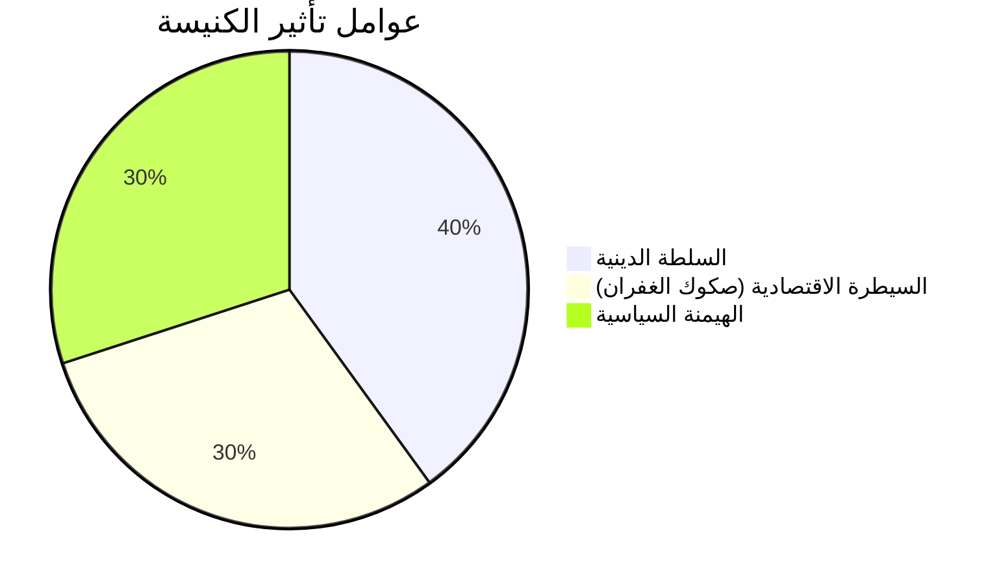

https://youtu.be/Tai_hP84gbM?si=EX8L_VglovIIPTKl
بسم الله الرحمن الرحيم الحمد لله رب
العالمين والصلاه والسلام على اشرف الخلق
اجمعين سيدنا محمد وعلى اله وصحبه وسلم
تسليما كثيرا الى يوم الدين اعزائي طلاب
الفرقه الثانيه بكليه التربيه بنين
بالقاهره السلام عليكم ورحمه الله وبركاته
واهلا ومرحبا بحضراتكم في محاضره جديده من
مقرر تاريخ التربيه ونظام
التعليم المحاضره تدور حول الفصل الخامس
بعنوان التربيه المسيحيه في العصور الوسطى
ان شاء الله الفصل الخامس هيبقى مقسوم على
محاضرتين معكم محمود مصطفى احمد مدرس بقسم
الاداره والتخطيط والدراسات المقارنه نبدا
على بركه
الله الفصل الخامس التربيه المسيحيه في
العصور الوسطى سوف
نتناول العناصر التاليه ما هي العصور
الوسطى وكم مدتها وهل كانت كلها على نسق
واحد ما هي العوامل والظروف المؤثره على
التربيه المسيحيه في العصور الوسطى ما
اهداف التربيه المسيحيه ما مؤسسات التربيه
المسيحيه في العصور الوسطى واخيرا ما
تقييم التربيه المسيحيه في العصور الوسطى
ما هي العصور الوسطه خلينا نتف يا شباب
انه اختيار سنه بعينها او حدث بذاته عشان
نحدد انه ده نهايه عصر او بدايه عصر من
عصور التاريخ ده امر بعيد عن الواقع
والحقيقه ليه لان التطور التاريخي يمتاز
بالتدرج والاستمرار وتتداخل حلقاته بعضها
في بعض فيما يشبه نمو الكائن الحي فان ما
اقدرش في الكائن الحي اقول ان والله السنه
الفلانيه هي بالظبط انه هي دي الفر السنه
اللي انتقل فيها الانسان من مرحله الى
مرحله من الطفوله الى الشباب من الشباب
الى الشيخوخه وهكذا فبالتالي نفس الفكره
في العصور التاريخيه انا ماقدرش اقول انه
في سنه محدده
مثلا سنه السنه رقم كذا هي السنه اللي
انتقل فيها عصر من عصر لاخر من العصور
القديمه الى العصور الوسطى الى العصور
الحديثه ما اقدرش اقول كده لانه
ا التحديد بهذا الامر صعب جدا لان العصور
متداخله والانتقال فيها يتم بشكل ايه بشكل
متدرج عشان كده
ا لازم ناكد على ظاهره تداخل العصور
التاريخيه بعضها في بعض بحيث لا تفصلها
حدود ضيقه وسنون معينه اي سنه معينه لكن
نقدر نلتمس العذر للمؤرخين عندما يحددون
سنه او بعض السنوات الهامه او حدث مهم
احداث كبرى لتكون فواصل بين العصور
التاريخيه بيكون الغرض المؤرخين ان هم
بيحددوا سنه محدده او حدث مهم يقولوا مثلا
حرب اكتوبر دي حدث مهم فبالتالي بيبدا
منها تاريخ معين الهجره هجره الرسول صلى
الله عليه وسلم حدث مهم فبالتالي يبدا
منها تاريخ محدد انهيار الامبراطوريه
الرومانيه حدث مهم فبالتالي يبدا منها زمن
محدد هم بيحددوا كده عشان يبقى سهل عليهم
ان هم يدرسوا ايه يدرسوا التاريخ ويبقى
سهل عليهم البحث في السنين وسهل عليهم
التاريخ
فبالتالي
ا اختيارهم لسنه محدده او حدث مهم ده
عشان يسهل عليهم ايه عمليه
الدراسه من حيث مفهوم العصور الوسطى اختلف
المؤرخون حول سنه بدايه ونهايه العصور
الوسطى الاوروبيه وكان لكل واحد منهم
اسبابه وفقا لمدرسته واتجاهه الفكري يبقى
اتفقنا انه ما فيش سنه محدده او حدث محدد
اقدر اقول منه انه انتهى عصر وابتدى عصر
وانه تحديدنا لكده بيبقى مجازا عشان نعرف
ندرس العصور ايه التاريخيه
طيب هنا بقى نقول ما هي العصور التاريخيه
العصور الوسطى العصور الوسطى هي مرحله
زمنيه امتدت لمده اكثر من 10 قرون يعني
امتدت تقريبا تقريبا لمده 1000 سنه وقد
اختلف المؤرخون حول بدايتها ونهايتها
فمنهم من يرى انها بدات سنه 330 ميلاديه
اشمعنى هذا التاريخ لانه ده عام بناء
القسطنطينيه العاصمه القسطنطينيه العاصمه
التي بناها ق الامبراطور قسطنطين واتخذها
عاصمه الامبراطوريه الرومانيه وترك روما
وده كان حدث مهم بالنسبه له انه ايه انها
بدايه ايه العاصم بدايه
ا العصور الوسطى بدايه العصور الوسطى سنه
30030
ميلاديه بعض المؤرخين يرى ان الحدث الاهم
سنه
335 وهو انقسام الامبراطوريه الرومانيه
الى قسمين شرقيه وغرب
ومن هنا من هنا قالوا ان هنا دي بدايه
العصور الوسطى الاوروبيه او العصور الوسطى
المسيحيه بعضهم بعضهم يرى ان سنه
476 هي السنه الاجدر ان تكون بدايه العصور
رسطه لماذا لانه انهارت فيها الامبراطوريه
ايه الامبراطوريه
الغربيه المؤرخين على مستوى التربيه
وغيرهم يرون ان سنه 529 ميلاديه هي بدايه
العصور الوسطى تقريبا لانه فيها اغلقت
اكاديميه افلاطون
وظهور اول امر منح للبركه قانون كهنوتي
يعني الكنيسه بدات تسيطر على المعرفه وعلى
التعليم واغلقوا اكاديميه افلاطون التي
كانت تدرس فيها فلسفه من وجهه نظر العلم
والتربيه قال لك ده ده سد منابع العلم
والمعرفه وبالتالي ده بالنسبه لي هو بدايه
ايه العصور الوسطى المسيحيه او العصور
الوسطى الاوروبيه طيب طيب كما اختلف في
نهايتها يبقى اذا اختلفوا في البدايه حول
ما بين اربع تواريخ ما بين 330 395 476
529 ميلاديه ولكل مؤرخ من هؤلاء المؤرخين
ا وجهه نظره طيب اختلف في نهايتها فقد ذكر
البعض انها انتهى سنه 1400 ميلاديه ومنهم
من ارخ نهايتها سنه 1453
ميلاديه ليه لانه العام ده هو عام فتح
القسطنطينيه
القسطنطينيه فتحت على يد الجيش العثماني
الجيش المسلم
العثماني على يد محمد الفاتح سنه 1453 وده
كان حدث مهم جدا في التاريخ وبالتالي رخوا
بنهايه ايه فتره العصور الوسطى وممكن اضيف
لحضراتكم كذلك تاريخ تاني في ناس بتقول
قول انه انتهت العصور الوسطى سنه
1517 ميلاديه
ودي ده التاريخ اللي حصل فيه و ثوره مارت
لوسر على الكنيسه ثوره مارت لوثر على ايه
على الكنيسه وبالتالي زي ما قلت لحضراتكم
ان العصور الوسطى دي امتدت كا سنه تقريبا
1000 سنه طب بدايتها امتى هنقول بدايتها
مختلفين في بداياتها ما بين اكثر من تاريخ
وكل مؤرخ من المؤرخين وجهه نظر طب انتهت
امتى ايضا اختلفوا في نهايتها بين عام
1400 ميلاديه ومنهم من ارخ نهايتها بسنه
1453 ا ميلاديه على ي حيث نهار حيث فتحت
القسطنطينيه وتحولت الى اسطنبول
ا اي ارض
الاسلام او مدينه الاسلام عام
1453 على يد الجيش محمد على يد الجيش قائد
محمد ايه محمد الفاتح طيب تعالوا بقى
العصور الوسطى في حد ذاتها ما هياش عصر
واحد انما ممكن ان نقسم العصور الوسطى الى
جزئين نقسم العصور الوسطى الى ايه الى
جزئين العصور الوسطى المظلمه والعصور
الوسطى شبه المضيئه العصور الوسطى المظلمه
والعصور الوسطى ايه شبه
المضيئه العصور الوسطى المظلمه دي امتدت
تقريبا من عام 500 ميلاديه الى 1000
تقريبا يعني هي من سنه من سنه 500 الى
1000 يعني كل واحده من العصور دي امتدت
500 سنه واحنا بنقول تقريبا امتدت من 500
الى 1000 ميلاديه تقريبا ودي تميزت بيه
بقى العصور الوسطى المظلمه تميزت هذه
العصور بانه بالتدهور الحضاري الذي اصاب
اوروبا بشكل عام المجتمع الاوروبي كله
وحيث انهارت فيه انهيار ايه
الحضاره الرومانيه
وضعف الاهتمام بالفكر
والمعرفه وضعف الاهتمام بالتقدم العلمي
والفكري والثقافي لم يبقى الا بصيص خافت
من النور ينبع من المؤسسات الدينيه مثل
مدارس الاديره والكاتدرائيات والاسقف وغير
ذلك يبقى دي بنسميها العصور الوسطى ايه
المظلمه الجزء الثاني العصور الوسطى شبه
المضيئه ودي تقريبا امتدت من سنه 1000 الى
1500 ميلاديه تقريبا برض 500 ايه 500 سنه
تقريبا وسميناها شبه المضيئه او العصور
الوسطى الحقيقيه العصور الوسطى الحقيقيه
لانه اوروبا بدات تاخذ من الحضاره
الاسلاميه خاصه ان الحضاره الاسلاميه
اقتربت كثيرا من اوروبا من حيث الموقع
الجغرافي حيث هناك الحضاره الاسلاميه في
بلاد الاندلس وفي قرطبه وفي اشبيليه دي
كلها تابعه بلاد الاندلس وبدا الاوروبيون
يذهبون الى تلك الاماكن جامعات قرطبه
وجامعات اشبيليه وغير ذلك يتعلمون على
ايدي المسلمين وينقلون العلم والمعرفه الى
بلادهم وبالتالي بدات اوروبا تستفيق مره
اخرى على يد الحضاره ايه الاسلاميه ومن ثم
سميناها العصور الوسطى شبه المضيئه او
سميناها العصور الوسطى ايه الحقيقيه يبقى
اذا عصور الوسطى دول اللي هي امتدت 1000
سنه نقدر نقسمها نصين 500 في العصور
الوسطى المظلمه و500 في العصور الوسطى ايه
شبه
المضيئه والعصور الوسطى شبه المضيئه اخذت
باوروبا من الحضاره الاسلاميه وبدات عندها
تظهر مدارس المدن وبدات عنها تظهر ايه
الجامعات تعالوا بقى نشوف دي خريطه
لاوروبا في العصور الوسطى ا هنا بقى
هتلاحظوا انه في في الخريطه دي اوروبا لم
تكن انقسمت بعد الى شرقيه وغربيه وان كانت
ايه
ا ادي قسطنطينيه
وادي روما هنا في ايطاليا عاصمه ايطاليا
وكانت تابعه لها فلسطين ومصر و جزء من
المغرب العربي وتابع لها جزء من سوريا
ا كل هذه يعني البحر الاحمر كان بيسموه
ايه البحر الروماني البحر ايه الروماني
لانه كان كله تابع
للامبراطوريه
الرومانيه طيب دي خريطه اخرى لكن كانت
انقسمت فيها اوروبا الى امبراطوريتي
الامبراطوريه البيزنطيه الشرقيه وعاصمتها
القسطنطينيه هذه العاصمه والامبراطوريه
الرومانيه الغربيه اللي هي تشمل القيصريه
البلغاريه وامبراطوريه الفرنجه وكل دي
كانت تابع امبراطوريه الرومانيه الغربيه
ما هي العوامل طبعا احنا بنعرض الخريطه دي
عشان نربط الموقع
[تصفيق]
بالموضع العوامل بقى المؤثره على
التربيه المسيحيه في العصور الوسطى ايه
الظروف الاحوال التي اثرت على اوروبا في
العصور الوسطى تعالوا بقى نشوف اول حاجه
الاحوال الدينيه الاحوال الا الدينيه
اوروبا في العصور الوسطى قبل ظهور سيدنا
المسيح عليه السلام كانت كل اوروبا وسنين
لكن الحدث الابرز واللي انتقل باوروبا بعد
ذلك بعد ذلك الى
العصور الوسطى وهو كان لب العصور الوسطى
هو الدين المسيحي انتشار ايه انتشار
المسيحيه سيدنا المسيح عليه السلام ولد في
عصر
اغسطس المتوفى سنه 14 ميلاديه ي سيدنا
المسيح عليه السلام ولد في عصر اغسطس
المتوفى سنه الامبراطور اغسطس توفي سنه
ايه 14 ميلاديه ولد سيدنا المسيح عليه
السلام في بيت لحم في بيت لحم في
فلسطين كان العالم الروماني في ذلك الفتره
في تلك الفتره يشعر بنوع من الفراغ
الديني لانه الرومان خاصه المثقفين منهم
ينظرون الى الديانه الوثنيه الدين الرسمي
كان للدوله الامبراطوريه الرومانيه على
انها تقديس الامبراطور الامبراطور كان
مقدس وكان يعبد كانوا ينظرون الى ذلك على
انها هي امور شكليه وغير مستساغه ولذلك
بداوا يبحثون على دين يعيد للحياه روحها
في الامبراطوريه ايه
الرومانيه لما ظهرت المسيحيه وظهر سيدنا
المسيح عليه السلام في فلسطين في بيت لحم
وبدات الدعوه الى المسيحيه الاباطره
الرومان لم يهتموا بالمسيحيه واعتبروها
ديانه فلسفيه الشرقيه واعتبروها زي
اليهوديه وانها ستنحصر في نطاق ضيق وانها
لن تنتشر ولكن مع تزايد المسيحيه مع تزايد
المسيحيه
وانتشارها
ا في الولايات
المختلفه ولم يكد يمر القرن الاول
الميلادي حتى اصبح في كل ولايه من ولايات
الامبراطوريه الرومانيه جاليه مسيحيه و
المسيحيين نفسهم بداوا طبعا المسيحيين
نفسهم بسبب تعليم الدين المسيحي بداوا
يرفضون العباده الوثنيه وينكرون تقديس ايه
تقديس الاباطره هنا بقى بدا الاضطهاد
للمسيحيين وبدات الحكومه الرومانيه تعتبر
ان اعتناق المسيحيه جرما في حق الدوله
فمنعت اجتماعات المسيحيين واخذت تنظم
الحملات الاضطهاديه ضدهم حتى وصلنا الى
عصر احد الاباطره اسمه دقليديانوس الراجل
ده قتل في المسيحيين كثير جدا اللي هو
بنسميه بيسموه المسيحيين عصر الشهداء
ويبدا منه تقويم المسيحي يبدا منه التقويم
المسيحي والعصر ده كان سنه
234 ميلاديه يعني سنه 284 اسف 284 ميلاديه
ده بنسميه عصر الشهداء والمسيحيين بيبدا
منه التقويم المسيحي سنه 284 ميلاديه وده
عاصر دقليديانوس
طيب
اعتبروه بدايه التقويم القبطي تخليدا
لذكرى ايه
الشهداء لكن لكن على الرغم من الاضطهاد
فانه المسيحيه هي التي خرجت منتصره خاصه
ان الامبراطور
قسطنطين سنه 1000 سنه 313 ميلاديه اصدر
مرسوم ميلان الشهير انه خل اللي خلى فيه
الديانه المسيحيه ديانه بجانب الديانه ايه
الوثنيه واعترف بها
ويتمتع وبالتالي اعترف بان يتمتع
المسيحيون بكافه الحقوق الاخرى مثلهم مثل
الديانه
الوثنيه لكن بعد كده اصبحت الديانه
المسيحيه هي الدين الرسمي فقط واعترف فيها
هيي الدين الرسمي فقط وذلك سنه 380
ميلاديه حيث اعلنت الديانه المسيحيه هي
الدين الرسمي الوحيد للامبراطوريه ايه
للامبراطوريه
الرومانيه طيب يبقى بالتالي بالتالي عرفنا
انه
ا من العوامل المؤثره المسيحيه وهنشوف ده
ليه لانه حضرتك بعد كده هتلاحظ خاصه في
العصور الوسطى شبه العصور الوسطى المظلمه
اللي قلنا عليها امتدت ل 500 سنه هنلاقي
انه معظم المدارس والتربيه واهداف التربيه
تمحورت حول الديانه المسيحيه وبعد كده
المسيحيه هيظهر هيظهر عامل ثاني يديها قوه
اكبر وهو النظام البابوي او
الكنيسه الكنيسه الاوروبيه انقسمت الى
كنيستين رئيسيتين لانه الامبراطوريه نفسها
سنه
476 انقسمت الى امبراطوريتي شرقيه وغربيه
شرقيه هي امبراطوريه البيزنطيه وغربيه وهي
الامبراطوريه الرومانيه واصبح هناك
كنيستين اساسيتين ك كسه روما وكنيسه ايه
ايه صوفيا التي تحولت الى مسجد بعد فتح
محمد الفاتح القسطنطينيه وكيد حضراتكم
سمعتوا عن الموضوع
اللي حصل بعد كده ان هم بعد كده رجعوا
الكنيسه و
اصبح رجعوها الى متحف وبعد كده ده في
العصر الحالي اللي احنا ماشيين فيه وبعد
كده حولوها تاني الى مسجد طيب النظام
البابون نتيجه انه الكنيسه اصبح لها سيطره
واصبح لها نفوذ ومعظم الشعب الاوروبي في
تلك الفتره اصبح مسيحيا
ا الكنيسه اصبح لها دور كبير في الحياه
الاوروبيه في العصور
الوسطى
وبالتالي المجتمع اصبح مجتمع مسيحي واصبح
فييه قوه اساسيه هي الكنيسه واختاروا على
راس الكنيسه البابا النظام الباباوي
البابا اصبح مع مرور الوقت يشاب به ملك
الملوك وامير الامراء واصبح هناك بلاط
للايه لمين للبابا اصبح هناك ايه بلاط
للبابا واصبحت سلطه البابا سلطه كبيره جدا
خاصه في روما ليه لان روما انهارت فيها
الامبراطوريه الرومانيه واصبح هناك فراغ
سياسي اللي ملى الفراغ السياسي ده هو مين
هو البابا وبالتالي جمع البابا بين سلطتين
السلطه
الدينيه باعتباره هو رئيس جهاز الديانه
المسيحيه
والسلطه الزمن الزمنيه او السياسيه اللي
هو ايه سلطه الامبراطور حيث كانت
الامبراطوريه ايه قد قد انهارت طيب
وبالتالي اصبح للبابا شان كبير واصبح
للكنيسه امتداد كبير عند المسيحيين واصبح
لها اراضي واصبح لها اقطاعيات واصبحت لها
ممتلكات ماليه كثيره جدا هنتكلم عنها
ومن
ثم اصبح هناك بلاط للبابا مثله مثل ايه
مثله مثل الامبراطور بلاط وله اداره تنظر
في
شؤون البابويه وتثبت حقوق البابويه فيها
وتدافع عنها لان لها ممتلكات تدر عليها
ايه دخلا دخلا شديد طيب ايه بقى اللي ادى
البابا كذلك قوه اكبر البابا كان عنده
اسلحه بيستخدمها السلاح الاول هو توقيع
عقوبه الحرمان او القطع او الشلح بمعنى
ايه بمعنى انه اللي ما يسمعش كلام البابا
سيقطع من الرحمه سيشل من الرحمه زي ما
بيقولوا هي عقوبه القطع او الشلح سواء
كانت بطريقه فرديه شخصيه اي ضد فرد معين
ولما فرد معين يعاقب بعقوبه الحرمان ده
عقب عقوبه قصيه جدا ليه لانه يصبح الفرد
منبوز ومطرود من المجتمع المسيحي ف فلا
يسمح فلا يسمح لاحد بالاقتراب منه او
التعامل معه سوى زوجته وا اولاده اما
السلاح الثاني اللي كان بيستخدمه البابا
فهو ايضا عقوبه الحرمان الجماعي يعني
حرمان فردي وحرمان ايه حرمان جماعي وممكن
البابا يوقي حرمان جماعي على المجتمع
باكمله ا سواء كان هذا المجتمع مدينه او
اقليم او حتى مملكه باسرها وفي هذه الحاله
هي اللي بيحصل تغلق الكنائس ابواب وتغلق
الكنائس ابوابها ويضرب رجال الدين عن
تاديه اعمالهم فلا يجد الناس فلا يجد
الناس ما احد يقضي مصالحهم المرتبطه
بالكنيسه زي التعميد زي الزواج زي الشعائر
الجنائزيه فضلا عن انقطاع الروابط التي
تربط ذلك المجتمع بدينه ايه المسيحي يبقى
اذا البابا كان عنده اسلحه قويه ساعدته
على التحكم في المجتمع وان يصبح له سلطه
كبيره جدا زي ما قلت لحضراتكم كذلك ايضا
ساعدوا على ذلك ا الايرادات الماليه
الايرادات ايه الماليه وزي ما قلت
لحضراتكم دخلاه اصبح عنده بلاط واصبح
البابا يعيش في ابهه وعظمه وفخامه وعنده
موظفين وامناء والقاب وله جهاز
اداري ينفذ اطماع البابويه وسياساتها
الايرادات الماليه اللي جات له من الاموال
من الاراضي كان تبعه جات له من الحروب
الصليبيه اللي استغلوها بعد ذك لك اسوا
استغلال ودفعوا بالاوروبي الى العالم
الاسلامي لينهوا خيراته لانه كان متقدم في
تلك الفتره كانوا كمان بيستغلوا الناس
ازاي كانوا بيقولوا انه اللي هيروح في
الحروب الصليبيه دي هنديله سق بعد ذلك
باسمه سق الغفران يعني انت اشتركت في حرب
مقدسه فهن لك بعد كده عقد او ورقه او صك
يعني سق ده
اعتراف او زي ما بيقولوا احنا ايه مخالصه
زي ما بيعمل في الضرايب تروح تدفع فلوس
وبتاخد مخالصه هنا نفس القصه هتروح تشترك
في الحروب الصليبيه اللي هي الحروب مقدسه
وهندي مخالصه او سق غفران او اعتراف ان
انت تم مغفره ذنوبك مش كده وبس ده
بداوا يعملوا حاجه اسمها سقوق الغفران
بمعنى ايه ودي ظهرت في اوروبا في العصور
الوسطى ا وبدات تصبح تجاره رائجه ازاي
ركزوا معايا كده يا شباب كان الواحد فيهم
عشان يتولى اقفيت كنيسه ويبقى ماسك كنيسه
كان بيذهب الى البابا ويدفع له اموال ايه
عشان يطلع امر انه هو ايه
يبقى اسقف الكنيسه معينه تمام طيب ليه
لانه ويديله كمان الحق في بيع سقوق
الغفران يعني ايه يعني مثلا المواطن
المسيحي العادي يذهب الى الكنيسه
و يعترف في الكنيسه انه اقترف خطا معين ف
القسيس في الكنيسه او الذي
ا يعني مسؤول عن
الكنيسه يخبره انه ذنوبه قابله للغفران في
مقابل دفع مبلغ معين ان انا هدفع فلوس
معينه مثلا وليكن مثلا انت هتدفع مبلغ قد
كده والذنب بتاعك هغفل وبالتالي اصبح
التجاره رائجه رائجه جدا لانه المسيحي
هيروح طبعا عشان يحصل على سق الغفران اللي
هيع فيه من الذنب وبالتالي بدا ان انت
عشان تاخد كنيسه قسيس ياخد كنيسه او يعني
ويبقى مسؤول عنها بيدفع مبلغ كبير جدا من
المال للبابا وبالتالي ده كله كان بيدر
دخل على اوروبا او على النظام البابوي
عشان كده ازداد
قوه طيب بعد كده هنشوف من العوامل المؤثره
ايضا الامبراطوريه خاصه في الشرق اذا كان
البابا يمثل السلطه الدينيه فان
الامبراطور هو يمثل السلطه ايه الزمنيه دي
احوال السياسيه طيب لانه الامبراطوريه
الرومانيه كانت متسعه جدا وامتدت من
المحيط الاطلسي غربا حتى نهر الفرات شرقا
وكانت فيها سلطه مركزيه
ا وكانت فيها شعوب مختلفه وزي ما قلت
لحضراتكم انه سنه 395 انقسمت الامبراطوريه
الى امبراطوريه شرقيه وهي عاصمتها
القسطنطينيه وامبراطوريه غربيه وعاصمتها
روما لكن سنه 476 انهارت امبراطوريه
الرومانيه الغربيه على يد قبائل ايه
الجرمانيه وخربوا روما واقاموا بدلا منها
الممالك
الجرمانيه الكلام ده ظل حتى سنه 800
ميلاديه لما توج الامبراطور لما توج
شارلمان امبراطورا لروما مين اللي توجه
البابا كان في شبه اتفاق ضمني ازاي انه
الامبراطور لا يتدخل في عمل البابا بشرط
انه البابا يعترف بالامبراطور
ان هو الحاكم السياسي وانه هو خليفه الله
في السياسه زي ما انه البابا هو خليفه
الله في الدين فان الامبراطور هو خليفه
الله فين في السياسه فكان في اتفاق ضمني
وللاسف هذا الاتفاق اص يعني بالعكس على
الشعوب الاوروبيه في تلك الفتره وعلى
الحياه الاوروبيه في العصور الوسطى لما
جاء شارلمان سنه 800 ميلاديه واتعين ا
امبراطور للامبراطوريه الرومانيه الغربيه
ا اعاد جزء كبير من مظاهر الحضاره
الرومانيه لكن بعد موت شارلمان بدا الصراع
يدب مره اخرى بين رجال الدوله والكنيسه
واصبحت وانهارت امبراطوريه رو روما مره
اخرى امبراطوريه شارلمان انهارت وتقسمت
الى عده دول اللي هي منها دلوقتي اللي هي
منها دلوقتي فرنسا اللي هو باسمها كان
زمان بلاد الفرنجه والمانيا وايطاليا
بالتالي بدات بعد كده هتظهر ايه هي الدول
الحديثه كذلك ايضا كان العرب في تلك
الفتره اصبحوا قوه واصبح عندهم نهضه
وحضاره لانه خلوا بالكم شارلمان
الامبراطور شارلمان عاش في نفس العصر اللي
عاش فيه الخليفه هارون الرشيد عصر الدوله
العباسيه
طيب من العوامل المؤثره الاحوال
الاجتماعيه ايه شكل المجتمع ايه الطبقات
الموجوده مركز المراه في المجتمع اول حاجه
المجتمع الاوروبي كان يتميز بالطبق
والاقطاع وانقسم الى ثلاث طبقات رجال
الدين اللي هم تابعين للكنيسه طبقه
المحاربين اللي هم فرسان ونبلاء عشان في
اقطاع عشان كل
منطقه متسلط عليها نبيل او فارس يتحكم
فيها ا وطبقه الفلاحين اللي هم الطبقه
المستضعفه الطبقه ين الاولتين كانتا
تمثلان الهيئه الحاكمه من وجهه النظر
السياسيه
والارستقراطي السائده من وجهه نظر المجتمع
في ذلك الفتره وهم الفئه السريه من وجهه
النظر الاقتصاديه في حين طبقه الفلاحين هي
تمثل جموع الكادحين المغلوبين على امرهم
المحرومين من النفوذ والثوره والثروه لانه
الاقطاع اللي كان منتشر في تلك الفتره
يعني ايه اقطاع يعني منطقه زي محافظات
مثلا وكل محافظه او مدن كل مدينه لها حاكم
وهو يملك الارض ومن عليها من البشر ولذلك
انتشر لفظ اسمه القن والقنين القن هو
العبد والقنين هي الامه يعني كان كثير من
المسيحين اقن اي عبد للاقطاب
والفلاحين كانوا النبلاء كانوا هم يحكموا
ويحاربوا ورجال الدين يتعبدوا لله ويشبعوا
حاجات الناس الروحيه والفلاحون عليهم ان
يسددوا الحاجات الماديه للطبق
الاخيرتين طيب وبالتالي كان في فجوه واسعه
بين طبقتي الفرسان ورجال الدين والمحاربين
من جهه وطبقه الفلاحين والمزارعين من جهه
اخرى
وانه كان من الصعب جدا انه يحصل حراك
اجتماعي يعني الرجل الذي يولد في طبقه
معينه كان يعني مثلا لو واحد مولود تابع
لطبقه الاقطا
لا يستطيع ان
يكون تابع لطبقه الفلاحين والمزارعين لا
يستطيع ان يكون من طبقه ايه
الاحرار لكن الا اذا طبعا ايه حصل على
ثروه كبيره جدا لكنه برض يظل في وجهه
نظرهم وضيعا لانه ينتمي الى طبقه ايه طبقه
الاقطاع لانه ينتمي الى طبقه ايه الفلاحين
طيب وبالتالي
الطبقيه دي اثرت على المجتمع الاوروبي
وكان في طبعا زي ما قلت لحضراتكم النظام
الاقطاعي اللي هو يضم طبقه المحاربين
والنبلاء والفرسان وكان لهم نظام في
حياتهم اسمه نظام السياده على الفلاحين
والعمال او النظام السنيوري سينيور طبعا
لانه النظام ده كان بيقوم على ايه انه
بينظم العلاقه بين الفلاحين والاقطاعيين
على اساس انه العلاقه تكون هي قائمه بين
حر وعبد
اي علاقه سيد حر يمتلك الارض بمن عليها من
المزارعين وهو
طبعا القن او العبد اللي قلت عليكم
حضراتكم عليها ولذلك كان بيقوم هذا القن
او العبد بدفع ضرائب للسيد الاقطاعي طب
اذا عجز هذا العبد فانه يكون عرضه للبيع
او الاستب دال او الطرد من من المدينه او
الارض لانه لما وكانت دي اصعب عقوبه ان هو
يطرد ليه لانه لما هيطرد منه يصبح العبد
او القن دون سيد يحميه طيب يبقى اذا كانت
طبقيه وكان نظام صعب جدا طيب اما مركز
وكان فيه الانسان او الفلاحين مهانين اما
مركز المراه في المجتمع فكان مركز ثانوي
بحت وكانت دائما المراه تحت الوصايه
ا لم تكن وصايه ابيها ان لم تكن وصايه
ابيها فهي ايضا في تحت وصايه زوجها يعني
دائما تحت وصايه رجل طبعا لم
تكن المراه تختار زوجها انما يتحكم في ذلك
المصالح العائليه او الماليه وبالتالي
كذلك ايضا
ا
الزوجه كانت كما مهملا
وا الزوجه كان عليها ان تنجب دائما ابناء
ذكورا فان اخفقت في هذه المهمه كان من
السهل على زوجها غالبا ان يغري الاسقف او
رجل الدين بفسخ ايه بفسخ ا العقد طيب
الكنيسه كانت فين هنا بقى من من من المراه
نظره الكنيسه للمراه كانت موقف متناقض من
المراه يعني كان موقفها دائما موقف ايه
متناقض من المراه لانه كانت لها نظرتين
اول حاجه اعتبرتها من ال يعني النظره
الاولى نظره دونيه للمراه ليه لانها
اعتبرتها شريكه لادم وهي التي حرضت على
المعصيه والخطيئه وهي لذلك تستحق كل
احتقار وامتهان
طيب لكن في نظره ثانيه نظرت اليها نظره
نظره سمو واحترام لانها من وجهه نظرهم
تمثل سيده مريم العذراء ام المسيح عليه
السلام وهي لذلك جديره بكل احترام وتقدير
وان كانت النظره الاولى جعلت الكنيسه اللي
هي نظره انها
المراه محتقر ومهانه تطالب الرجل بعدم
الزواج على اساس ان المراه عامل من عوامل
الغوايه ولذلك هتنتشر الرهبنه هتنتشر ايه
الرهبنه لانه ينظرون الى المراه انها عامل
من عوامل ايه من عوامل
الغوايه لكن اللي الطبقه اللي احترمت
المراه هي الطبقه الارستقراطيه الى حد ما
لانه هي اللي طورت فكره احترام المراه
لانه كان من الصفات التي يجب ان يتميز بها
الفارس تبجيل المراه وان يكون نصيرا لله
ولل المراه وبالتالي عاوزين نقول انه
المراه هنا في العصر ده كان مركزها ثانوي
وانها لم تتمتع بحقوق كثيره وحتى انه
الكتاب في في العصور الوسطى الاوروبيه او
المسيحيه ايدوا حق الزوج في ضرب زوجته
وازها اذا خالفته وكذلك ايضا الكنيسه حددت
حجم العصا التي يصح للزوج ان يستخدمها في
ضرب ايه
زوجته واذا كانت المراه
الارستقراطيه اتمتعت بقسط من الراحه
والتسليه فان المراه في في طبقه الفلاح
الفلاحين
والعبيد حرمنا من كل النعمه لانهن كان
يتعرض لقسوه شديده في الحياه وكن يصبحن
ايضا من الاقنان يبقى اذا الاحوال
المجتمعيه كانت تسود بين الطبقيه والنظام
السنيوري وثلاث طبقات موجوده في المجتمع
وكل طبقه لها لها
ا مميزات وفقا لنوع هذه الطبقه اما طبقه
فلاحين فكانت تعاني من قسوه الحياه وان
مركز المراه كان مركزا ثانويا وانما ساعد
على امتهان المراه واحتقارها نظره الكنيسه
اليها الا ان الطبقه الارستقراطيه وخاصه
طبقه النبلاء والفرسان كانت تحترم المراه
بشكل
كبير العامل الاقتصادي اللي هو ايه بقى
التجاره والزراعه والصناعه تعالوا نشوف
الاقتصاد الاوروبي اتخذ طابعا زراعيا بحتا
في البدايه خاصه في العصور الوسطى شب عصور
الوسطى المظلمه انعدمت فيها التجاره او
كادت تنعدم واصبحت الارض ودها هي الاساس
الذي قام عليه بناء الحياتين الاقتصاديه
والاجتماعيه في اوروبا ده اعاق تقدم
الحياه الاقتصاديه واقتصرت التجاره على
التجاره المحليه الضيقه اللي خلى الكلام
ده ايه اللي حصل اولا ان الكنيسه نفسها
كان لها موقف ضد التجاره لانها كانت تنظر
الى التجاره
والى الكسب التجاري على انه غير حلال يعني
ينظرون الى الكسب التجاري على انه ايه غير
حلال
وبالتالي التجاره ضعفت في اوروبا والتبادل
التجاري ضعف في اوروبا والاقتصاد كان
اقتصادا ايه زراعيا بحتا لكن مع ظهور بدات
الاستقرار في العصور الوسطى شبه المضيئه
او الحقيقيه وبدا ارتباطهم بحضاره العرب
وبدا يبقى في سلام واستقرار خاصه من بدايه
القرن الحادي عشر من من سنه 1000 وانت
طالع كده جاءت الحروب الصليبيه كذلك ايضا
لتضيف عاملا قويا الى العوامل التي ادت
الى تحطيم النظام الاقطاعي يبقى هنا
النظام الاقطاعي هيبدا ايه هيبدا يتحطم
وبالت ليه لانه بدات الشعوب الاوروبيه
تخرج الى الحروب الصليبيه هربا من ا
النظام الاقطاعي ده ادى الى ايه الى تشجيع
التجاره والصناعه كذلك اوروبا في تلك
الفتره بدات تعرف مسالك التجاره مع الشرق
وبدا يحصل معه بينها ما بين الشرق ايه
التجاره ادى الى احياء التجاره والتجاره
بتادي الى ظهور طبقه جديده اسمها طبقه
التجار والتجار محتاجين الى العلم
والمعرفه عشان يضبطوا بها تجارتهم فانشا
مدارس ومجتمعات تجاريه وبدات تظهر ايه
النقابات والمدن هنا بدا الاقتصاد ايه بدا
الاقتصاد يتطور مره اخرى وبدا تشجيع
الصناعه والتجاره والنقابات التي بدات
تحافظ على حقوق المنتسبين اليها وتنظم
التجاره فيها والصناعه ا
التي ظهرت في اوروبا في تلك الفتره وظهور
المدن التي انتشرت فيها المدارس عشان كده
هنتكلم بعد كده عن مدارس المدن هنا بقى
نخش على عنصر مهم جدا من
العناصر المحاضره اهداف التربيه المسيحيه
في العصور الوسطى يبقى اخدنا العوامل
الاحوال
الدينيه انتشار المسيحيه والنظام البابوي
والاحوال الاقتصاديه والاحوال السياسيه
واتكلمنا عن النظام الاقطاعي واتكلمنا عن
الطبقات في اوروبا كل ده اثر على التربيه
في اوروبا تعالوا بقى
نشوف ما هي اهداف التربيه هنلاحظ هنا انه
العامل الديني كان له تاثير كبير جدا اول
حاجه هدف اساسي خدمه الرب والكنيسه والخلق
والنفس خدمه الرب والكنيسه والخلق والنفس
لانه الدوله اصبحت دوله مسيحيه وتحولت
الامبراطوريه الى امبراطوريه مسيحيه
واعترف بالدين المسيحي واصبح المثل الاعلى
التربوي المسيحي
ا هو انسان خادم للرب وبالتالي ده غير
المثل الاعلى في التربيه الرومانيه قبل
المسيحيه او نقدر نقول عليها التربيه
الرومانيه العلمانيه التربيه الرومانيه
العلمانيه كانت تريد رجلا حرا تربيه رجل
حر لكن هنا التربيه المسيحيه لا ركزت على
خدمه الرب والكنيسه والخلق والن نس ولذلك
اهتمت بالتربيه الروحيه اهتماما شديدا
واهملت التربيه الماديه او التربيه
البدنيه حمال الجسد عشان كده هتظهر ثنائيه
اسمها الروح والجسد وهتظهر الرهبنه وهتظهر
الاديره ليه لان كل ده بيركز على ان انا
انشئ انسان خادم للرب خادم للكنيسه
وبالتالي هنهتم بالروح ونقلل الاهتمام
بالجسد ومن ثم من ضمن الاهداف ان احنا
نكبح جماح الجسد جماح الانسان ونتصدى لشر
الكامن فيه ليه لان الروح حتى تسمو لابد
ان نقصو على الجسد ونقلل من رغباته
وشهواته عشان ايه حتى تسم ايه الروح لانه
التربيه اساسا هنا في المسيحيه تربيه ايه
روحيه طيب وكان من ضمن اهداف التربيه
المسيحيه التكفير عن الخطيئه الاولى ما هي
الخطيئه الاولى خطيئه سيدنا ادم عليه
السلام وهي اكله من الشجره ونزوله الى
الارض لانه المسيحيه تؤمن ان كل انسان
يولد وعليه جزء من هذه الخطيئه الاولى
مذنب يعني وبالتالي لابد ان يكفر وكذلك
تؤمن ان سيدنا المسيح عليه السلام
حينما نزل الى الارض كان
ا حينما بعث عليه السلام كان الهدف من ذلك
ان يكفر عن الخطيئه الاولى للعالم ولذلك
يقولون انه صلب عشان كده ايه ليكفر عن
الخطيئه الاولى طبعا الكلام ده مخالف
للدين
الاسلام كذلك ايضا المسيحيه اهتمت بشكل
كبير بالحياه الاخره واعطت قيمه كبرى
للمسائل ايه الروحيه وينظرون الى وحده كل
البشر وانه ليس هناك ايه ليس هناك
ا اختلاف بين البشر وان البشر متساوون
وينظرون نتيجه اهتمامهم بالحياه الاخره
والتربيه الروحيه ينظرون الى ان ان لكي
تحصل على الخلاص وتدخل في ملكوت السماء ف
فلا بد ان يكون هناك بينك وبين الجسد
خصومه ليه لان الانسان مخطئ بطبعه
وا عشان يستخلص روحه من الجسد ومن الخطيئه
المتوارثه عن ابي البشر ادم لابد ان يسير
على نفس الضرب الذي صار عليه ايه سيدنا
المسيح عليه السلام كذلك المسيحيه كانت
تهتم بالعمل اليدوي والتدريب عليه ليه
لانه العمل اليدوي
ده هيتعب الجسد وبالتالي هيضعف الجسد
هيخلي الروح ايه الروح تسمو والعمل اليدوي
اعتبروه هو نظام للتربيه المعنويه لانه
هيشغلك وبالتالي يحفظ الفرد من الذنوب لكن
هنقول بقى هل الواقع العملي في العصور
الوسطى ساعد على تحقيق هذه المسل العليا
لا لكن ليه لانه ضغط على العقل الخرافات
والبدع والاوهام وسيطره الكنيسه
وا الكنيسه وضعت حاجز بين عقل الانساني
والمسيحي في تلك الفتره والعالم الخارجي
له وسيطرت على
التفكير المسيحي وكان رجال كان الشعب
المسيحي يطيعون رجال الدين طاعه
عميا طيب نخش بقى على مؤسسات التربيه
المسيحيه ودي مش هناخدها كلها في المحاضره
دي مؤسسات التربيه المسيحيه المسيه في
العصور الوسطى تعددت لاحظ كده معايا يا
شباب انه مؤسسات التربيه المسيحيه في
العصور
الوسطى معظمها معظمها خاصه في العصور
ووسطى المظلمه اللي سيطرت فيها الكنيسه ا
معظمها مرتبط بالدين معظمها مؤسسات دينيه
مدارس الاديره مدارس الشهداء مدارس تعليم
المبادئ المسيحيه مدارس الانشاد والغناء
مدارس الحوار الديني مدارس
الكاتدرائيات مدارس البلاط نشوف بعد كده
مدارس الفروسيه دي مرتبطه بطبقه الايه
النبلاء والفرسان مدارس المدن دي ارتبطت
بعد ظهور المدن مدارس النقابات اللي
ارتبطت في بعد ظهور الم المدن ايضا
والنقابات التجاريه الحركه المدرسيه
واخيرا ظهور الجامعات لو حبينا نقسم حتى
المدارس دي الى فترتي العصور الوسطى الاور
المظلمه وشبه المضيئه هنلاقي انه مدارس
الاديره والشهداء كل المدارس الدينيه دي و
مارس الفرسيه ايضا تنتمي الى العصور
الوسطى المظلمه اما مدارس المدن والنقابات
والحركه المدرسيه وظهور الجامعات تنتمي
الى العصور الوسطى شبه المضيئه تعالوا بقى
نشوف اول واحده من هذه المدارس مدارس
الاديره والرهبنه مدارس القديره والرهبنه
طيب نتجت عن ايه المدارس القديره والرهبنه
دي اول المدارس دي زي ما قلت حضراتكم
مدارس قديره والرهبنه لانه احنا قالوا هم
ايه هنركز على التربيه الروحيه وانه في
ثنائيه الجسد والروح وانه لابد ان نهتم
بالروح على حساب الجسد وبالتالي ظهر الزهد
ظهر ايه الزهد والهروب من الدنيا لان هم
ينظرون انه ليست هناك سعاده في العالم
الدنيوي الذي لا يخرج عن كونه وادي للدموع
الدنيا بالنسبه لهم هي ايه وادي للدموع
وبالتالي انت عشان تخرج عن ال
العالم ده والفساد اللي موجود لا بد ان
تبعد عن المجتمع وتهرب من هذا المجتمع
وتنعزل عنه وتبني لنفسك مكان صومعه او دير
تترهبن فيه فاذا هي هروب من الواقع
الرهبان كانت ايه هروب من
الواقع خاصه انه الكنيسه في البدايه او
المسيحيين في بدايه تعرضوا ايه للاضطهاد
طبعا في انواع من الرهبنه الرهبنه
الانفراديه طبعا لكن لما حصلت الرهبان
الانفراديه كانت صعبه جدا لانها تخالف
فطره الانسان الاجتماعيه وبالتالي بدا
الرهبان يتجمعون في مكان واحد فظهرت منه
الاديره الاديره وتحولت هذه المناطق الى
مراكز للتعليم والاقتصاد ايضا بعد ذلك طب
ايه الهدف من مدارس الاديره الهدف من
مدارس الاديره هو كبح كل رغبات الجسد
ومطالبه حتى يشقى الجسد وتسم ايه الروح
التضييق على حاجات الجسم وبالتالي عشان
تسم ايه تسم
الروح طبعا هنا هيقضي ايامه في في جوع
وحرمان ويلبس ملابس باليه ويحرم نفسه حتى
من نظافه ايه من نظافه الجسد وبالتالي
بدات تظهر ايه النظام الديري اول ما ظهر
الديره ظهر في مصر على يد القديس باخوم ده
صاحب اول مدرسه ديريه في مصر العليا في
الصعيد والذي نجح قبل وفاته سنه 348
ميلاديه في تاسيس تسعه ادره للرجال وواحد
للنساء ضمت بضعه الاف
من رجال الدين المسيحي لكن بعد كده انتشرت
وباخوم ده
كان جندي مقاتل في الامبراطوريه الرومانيه
او الجيش الروماني
انتشرت بعد كده حياه الرهبنه من مصر الى
الجزء الشرقي من العالم الروماني ومنها
الى بلاد الشام وبلاد ما بين النهرين
واسيا الصغرى حتى عرفت الغرب الرهبنه في
القرن الرابع الميلادي واشهر الاديره دير
بنديكت دير بندكت الذي انشئ سنه 529
ميلاديه الدير ده كان له قانون تتكون من
37 ماده اشهر الالتزامات اللي كانت محطوطه
على الرهب في دير بنكت هي العفه والفقر
والطاعه يعني تبقى فقير وعفيف ومطيع لصاحب
الدير او القائم على الدير طيب يبقى اذا
زي ما قلت لحضراتكم هذه هي ايه الاديره
والرهبنه طب وقلنا الهدف ان
احنا نكبح او نضيق على رغبات الجسم
ومطالبه لانه فضيله الراهب بتقاس بمدى
قدرته على عقاب الجسم واجهاد بالصوم
و عدم تناول الطعام او تناول قدر يسير جدا
منه وارتداء ملابس خشنه طيب ايه نظام
العمل في الدير ان هم كانوا بيروا ان
الكسل هو العدو الاول فاكرين الاهتمام
بالعمل اليدوي من الاهداف هنا بقى طبقوه
الكسل هو
ايه العدو الاول للانسان وبالتالي لابد ان
نشغل وقت مين الرهبان بشكل دائم عشان كده
كانوا عملوا ايه يوم قسموه الى عده اقسام
اللي هو منها قسم يشغلون انفسهم فيه
بالعمل اليدوي لمده سبع لمده
ا سبع ساعات يوميا وخلو لهم كمان ساعتين
في اليوم لقراءه النصوص المقدسه طب نتيجه
العمل اليدوي وكثره العمل اليدوي تحولت ا
الرهبنه الى مراكز تجاريه لان هم ايه هو
من ضمن الحياه الحات اللي مطلوبه منه انه
يبقى فقير ومطيع طب الحاجات اللي بيعملها
هو بقى في صناع مهره عندهم وفي اصبحوا
متعلمين لكل الحرف الحاجات اللي عندهم
يعملوا بها ايه بداوا يبيعوها لمن حولهم
من الناس فبالتالي اصبحت مراكز تجاريه لان
هم بداوا يزرعون الارض من حولهم لانه في
عمل يدوي يطالبون به ومن ثم اصبحوا
ايه اصبحت مراكز تجاريه طب واديره النساء
كانت ايضا تقوم بعمل اسط للكنيسه وتطريزها
لانهم عندهم نفس القانون اللي هو قانون
العمل
اليدوي طيب كذلك منهج الدراسه
عندهم الرهبان اهتموا بتعلم القراءه
والكتابه والحساب عشان ايه عشان يحافظوا
على التقويم الديني للايام المقدسه
بتاعتهم يعرفوا الايام المقدسه وعشان
يضبطوا عمليه الفلاحه اللي هم زراعه الارض
لانه اصبح لدى الدير ملكيات واسعه من
الاراضي
ا طب وكانوا يستخدمون طريقه الحفظ
والتلقين وكانوا كذلك ايضا
يحرمون النقاش ويستخدمون العقاب البدني
لفرد النظام طب المنهج بتاعهم كان بيتكون
من ايه كان في حاجه اسمها الفنون السبعه
الحره الفنون السبعه ايه الحره اللي عملها
ارسطو الفنون السبعه الحره تنقسم الى
قسمين الفنون الثلاثيه اللي هي النحو
والخطابه والمنطق ودي بتتعلق بعلوم اللسان
يعني نحو وخطابه ومنطق والفنون الرباعيه
وهي الفلك والموسيقى والحساب
والهندسه يبقى اذا الاديره دي بعد كده
اصبحت مراكز تربويه وتعليميه لانه كانوا
يتعلمون الحساب والقراءه زي ما ق حضراتكم
مش كده وبس وكانوا ينسخون الكتب المقدسه
لو بعد فتره كذلك ايضا لما دخلنا اكثر في
العصور الوسطى شبه المضيئه بداوا يكتبون
كتب الفلسفه وينسخ وها واصبحت الاديره هي
من حافظت على
الفلسفه مدارس بعد كده مدارس الشهداء
مدارس الشهداء دي تعتبر من اوائل المدارس
التي اقامها المسيحيون فاكرين بقى في
بدايه انتشار المسيحيه عصر الشهداء اللي
قلنا عليه لانه اضطهد اضطهد الاباطره
الرومان المسيحيين وبالتالي المسيحيين
انشاوا مدارس عشان يربوا المواطن المسيحي
الذي يستطيع مواجهه مصيره بشجاعه وثبات
وعشان نعده لمقاومه الرغبات الدينيه وعشان
ندربه على الدفاع عن نفسه في المحاكم
الرومانيه الوثنيه وعشان حتى يتحمل ايه
التعذيب البدني واكيد تسمعوا حضراتكم كلكم
عن قصه اصحاب الاخدود هي حصلت الفتره دي
عصر ايه الاضطهاد المسيحي الاضطهاد
للمسيحيين طب دي مدارس اسمها مدارس ايه
الشهداء حتى جاي من اسمها احنا بنعد
شهيد مدارس تعلم المبادئ المسيحيه
دي كانت مقرها في الكنائس وكان طلابها من
ابناء المسيحيين والراشدين من اليهود
والوثنيين اللي اعتنقوا المسيحيه شايفين
جايه من اسمها بقى احنا عاوزين نعلمهم
مبادئ المسيحيه راجل دخل جديد في المسيحيه
او يهودي او وثني عاوزين نعلم ايه مبادئ
المسيحيه دي كانت بتركز اكثر على التهذيب
الخلقي مع اهتمام بالموسيقى فقد انتشر
الترتيل بالمزامير ترتيلا موسيقيا وخاصه
في الشرق منذ السنوات الاولى من المسيحيه
بعد كده هتيجي مدارس اسمها مدارس الحوار
الديني المدارس دي كانت ارقى من مدارس
التعليم المبادئ المسيحيه كانت يعني اعلى
منها درجه وكان هدفها اعلم هنا بقى بعلم
مين ما بعلم ناس عاديين بعلم القساوسه
الموجودين في الكنيسه انتاج العقل
اليوناني يعني فلسفه افلاطون وارسطو طب
ليه عشان يقدر يبقى عنده ملكه من الحو في
الحوار ايه الديني ويستطيع ان يناقش
المدارس الفكريه اليونانيه وانه يدعم
الديانه المسيحيه
ويبرهن عليها التعليم فيها كان يتم
بالمشافهه وكان مقر الدراسه كان مده
الدراسه فيها لمده ايه ثلاث سنوات المرحله
الاولى منهم في الم
في الثلاث سنوات دول ا في المقرر بتاعها
اللي بيمت لمده ثلاث سنين الاول نختبر
قدرتهم
ا الطلاب والقساوسه على وولائهم
المبادئ المسيحيه والمسن العليا ليها وبعد
كده نؤهل المسيحيين الى ان يكونوا اساقفه
ومعلمين في المدارس المختلفه طب مين
المعلم في مدارس الحوار الديني الاساقفه
هم المعلمون في هذه
المدارس بعد كده ظهرت مدارس تسمى مدارس
الكاتدرائيات يعني ايه الكاتدرائيه يا
شباب الكاتدرائيه هي الكنيسه الكبيره زي
ما احنا عندنا في مصر كده الكاتدرائيه ايه
الموجوده في العباسيه
وواحده موجوده في اسكندريه الكاتدرائيه
بيسموها الكرازه المرقسيه لان
ايه كنييسه كبيره ودي بتساوي عندنا دلوقتي
المدارس الثانويه نشات مدارس الكاتدرائيه
متبعه نظام المدارس الحواريه ثم اصبحت
مراكز يدرس فيها رجال الدين يعني دي بقى
ايه درجه عليا لرجال الدين بعد ما يخلص
المدارس الحواريه يخش على مدارس
الكاتدرائيات وكان يتوقف ترقيه رجل الدين
المسيحي
على حصوله ودراسته على هذه المدارس
الكاتدرائيه ولما نمت المسيحيه في اوروبا
وازدهرت والكنيسه زادت ازدادت الحاجه الى
رجال الدين وبالتالي اتسعت هذه المدارس
يبقى اذا المدارس دي اتسعت وتطورت عشان
ازدادت المسيحيه واصبح هناك حاجه لرجال
الدين واصبحت لهذه المدارس مكانتها ايه
مكانتها الكبيره بعد ان سقطت الوثنيه وا
واعلنت المسيحيه دينا رسميا في اوروبا طب
هدفها ايه المدارس دي زي ما قلت حضراتكم
هدفها اعداد رجال الدين والقساوسه لتولي
الوظائف فيها طيب مين هم المعلمون
القساوسه هم اللي كانوا المعلمون القساوسه
بقى بس هم اعلى درجه طيب الاولاد كانوا
يدخلون هذه المدارس في سن سته الى سبع
سنوات وكانوا يتلقون دراسه مختلفه حسب حسب
قدره الطف مختلفه في مدتها وطولها وكمان
مختلفه من مكان من مدينه لاخرى ومن فتره
لاخرى وزي ما قلت لحضراتكم كانت هذه
المدارس تعد هي ايه
المدارس مدارس ثانوي اولاد الفقراء نادرا
ما كانوا يدخلون المدارس هذه المدارس
المدارس اللي هي مدارس الكاتدرائيات ليه
لانها كانت
كانت للطبقات الافضل ولم تكن هناك التعليم
المجاني حتى اقرت الكنيسه ذلك سنه 1179
دخول بعض ابناء الفقراء الى هذه
المدارس اعزائي الطلاب المعلمون المستقبل
شكرا لكم على حسن استماعكم والسلام عليكم
ورحمه الله تعالى وبركاته

---

# التربية المسيحية في العصور الوسطى الأوروبية  
## مقدمة  
- **الفصل الدراسي**: الفصل الخامس من مقرر تاريخ التربية.  
- **الهدف**: تحليل نظام التربية المسيحية في أوروبا خلال العصور الوسطى (المظلمة وشبه المضيئة).  

---

## أقسام المحاضرة  
1. تعريف العصور الوسطى ومدتها.  
2. العوامل المؤثرة على التربية المسيحية.  
3. أهداف التربية المسيحية.  
4. مؤسسات التربية المسيحية.  
5. تقييم التربية المسيحية.  

---

## 1. العصور الوسطى: التعريف والمدّة  
### 📌 الخصائص العامة:  
- **مدة زمنية**: امتدت قرابة 10 قرون (من القرن الخامس إلى القرن الخامس عشر الميلادي).  
- **التقسيم الزمني**:  
  - **العصور المظلمة**: (500–1000 م) → تدهور حضاري، هيمنة الكنيسة.  
  - **العصور شبه المضيئة**: (1000–1500 م) → نهضة نسبية بفضل التواصل مع الحضارة الإسلامية.  

### 📌 خلافات المؤرخين حول التواريخ:  
| الحدث               | التاريخ المقترح | السبب                                   |
| ------------------- | --------------- | --------------------------------------- |
| بداية العصور الوسطى | 330 م           | بناء القسطنطينية.                       |
|                     | 395 م           | انقسام الإمبراطورية الرومانية.          |
|                     | 476 م           | سقوط الإمبراطورية الرومانية الغربية.    |
|                     | 529 م           | إغلاق أكاديمية أفلاطون.                 |
| نهاية العصور الوسطى | 1453 م          | فتح القسطنطينية (العثمانيون).           |
|                     | 1517 م          | ثورة مارتن لوثر (الإصلاح البروتستانتي). |

---

## 2. العوامل المؤثرة على التربية المسيحية  
### 🔴 العامل الديني:  
- انتشار المسيحية كدين رسمي للإمبراطورية الرومانية (سنة 380 م).  
- سيطرة الكنيسة الكاثوليكية عبر:  
  - **سلطة البابا**: جمع بين السلطة الدينية والسياسية.  
  - **أسلحة التأثير**:  
    - الحرمان الفردي/الجماعي من رحمة الكنيسة.  
    - صكوك الغفران (تجارة دينية لبيع المغفرة).  

### 🔴 العامل السياسي:  
- انهيار الإمبراطورية الرومانية → فراغ سياسي ملأته الكنيسة.  
- النظام الإقطاعي:  
  - **الطبقات الاجتماعية**:  
    1. رجال الدين.  
    2. النبلاء/المحاربين.  
    3. الفلاحين (الأقنان).  

### 🔴 العامل الاجتماعي:  
- مركز المرأة الثانوي:  
  - وصاية الرجل (الأب/الزوج).  
  - نظرة الكنيسة المتناقضة: بين احتقارها (كرمز للخطيئة) وتقديسها (كمريم العذراء).  

### 🔴 العامل الاقتصادي:  
- اقتصاد زراعي → ضعف التجارة.  
- نهضة تجارية لاحقة (في العصور شبه المضيئة) بسبب:  
  - الحروب الصليبية.  
  - التواصل مع الحضارة الإسلامية في الأندلس.  

---

## 3. أهداف التربية المسيحية  
- **الهدف الرئيسي**: خدمة الرب والكنيسة عبر:  
  1. تزكية الروح على حساب الجسد (الرهبنة، الزهد).  
  2. التكفير عن الخطيئة الأصلية (عقيدة الصلب والفداء).  
  3. إعداد الفرد للحياة الآخرة (إهمال الجانب المادي).  
- **أهداف فرعية**:  
  - تعليم المبادئ الدينية الأساسية.  
  - تدريب رجال الدين لإدارة الكنيسة.  

---

## 4. مؤسسات التربية المسيحية  
### 🔴 مدارس الأديرة:  
- **الهدف**: تربية روحية صارمة عبر:  
  - نظام صارم (الصوم، العمل اليدوي، العزلة).  
  - **المنهج**: الفنون السبعة الحرة (النحو، الخطابة، المنطق، الفلك، الموسيقى، الحساب، الهندسة).  

### 🔴 مدارس الكاتدرائيات:  
- **الوظيفة**: إعداد القساوسة والنخبة الدينية.  
- **المنهج**: فلسفة يونانية + لاهوت مسيحي.  

### 🔴 مدارس المدن (في العصور شبه المضيئة):  
- **السبب**: ظهور الطبقة التجارية.  
- **المنهج**: مهارات عملية (قراءة، كتابة، حساب).  

### 🔴 مدارس الفروسية:  
- **الفئة المستهدفة**: أبناء النبلاء.  
- **المنهج**: فنون القتال + قيم الشرف (ولاء للكنيسة والإقطاعي).  

---

## 5. تقييم التربية المسيحية  
### 💡 الإيجابيات:  
- حفظ التراث الثقافي اليوناني عبر نسخ المخطوطات.  
- نشر مبادئ المساواة الروحية بين البشر.  

### 💡 السلبيات:  
- قمع التفكير النقدي (الخضوع الكلي لتعاليم الكنيسة).  
- إهمال العلوم المادية لصالح اللاهوت.  

---

# ملخص مرئي  
